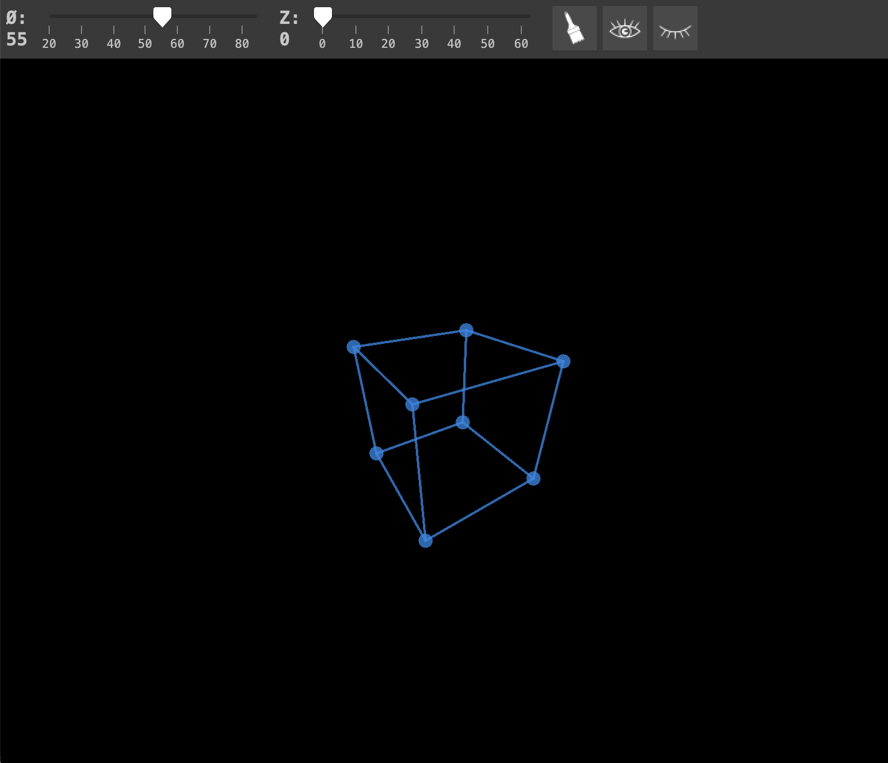
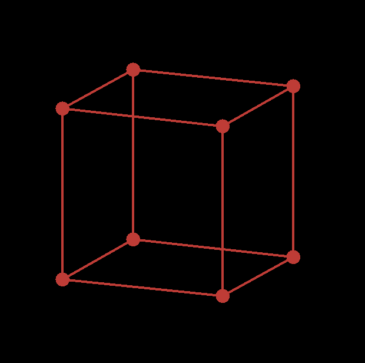
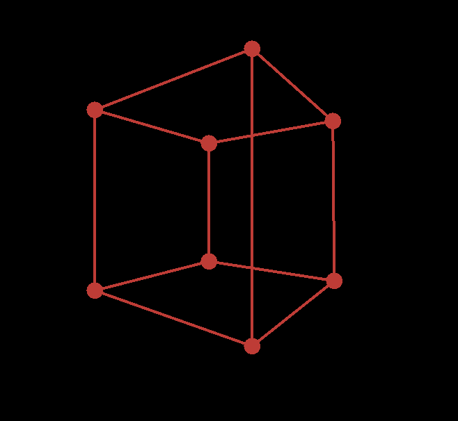
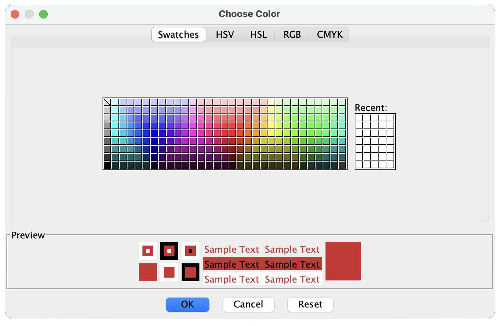
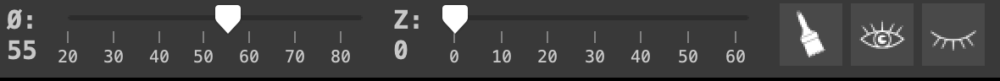

# 3D Cube Projection | Java

[](https://www.java.com/)
[](#)
[](#)
[](#)
[](#)


> A Java-based 3D rendering project focused on understanding the mathematics and implementation behind 3D projections.

## About

A Java program for 3D cube rendering using both orthographic and perspective projections. The project features custom classes, mathematical calculations with matrices, and GUIs that include adjustable buttons, sliders, etc. (Work in progress)


---

## Features

* Real-time 3D cube rendering
* Orthographic projection
* Perspective projection
* Matrix-based mathematical calculations
* Interactive cube rotation
* Mouse controls
* Keyboard controls
* Adjustable GUI controls
* Sliders for modifying rendering parameters
* Custom-built vector and calculation classes
* Java Swing GUI

---

## Preview

> Screenshots will be added as development continues.

<table>
  <tr>
    <td></td>
    <td></td>
    <td></td>
    <td></td>
    <td></td>
  </tr>
</table>

---

## Downloads

### Latest Release

You can download the latest version of the project from the **Releases** section:

[](https://github.com/Mesippo/3D-Cube-Projection-Java/tree/main/Downloadable%20Jars)

> **Note:** The project is currently a work in progress, so releases may change frequently.

### Source Code

To download the source code directly:

[](https://github.com/Mesippo/3D-Cube-Projection-Java/tree/main)

---

## Installation

### Requirements

* **Java JDK 17 or newer**
* Git *(optional)*

### Clone the Repository

```bash
git clone https://github.com/mesippo/3D-Cube-Projection-Java.git
cd 3D-Cube-Projection-Java
```

### Run the Project

Open the project in your preferred Java IDE and run the main class.

Compatible IDEs include:

* IntelliJ IDEA
* Eclipse
* Apache NetBeans
* Visual Studio Code

---

## How It Works

The renderer uses mathematical transformations to convert 3D coordinates into 2D screen coordinates.

The project explores concepts including:

* 3D vectors
* Matrix multiplication
* Rotation matrices
* Coordinate transformations
* Orthographic projection
* Perspective projection
* 3D-to-2D coordinate conversion

The goal is to implement these concepts manually rather than relying entirely on an external 3D engine.

---

## Project Structure

```text
src/
└── PhysicsEngine3D/
    ├── CustomEngine/
    │   ├── Calculations.java
    │   ├── InputControls.java
    │   └── PVector.java
    │
    ├── DCube.java
    └── Panel.java
```

> Project structure may change as development continues.

---
